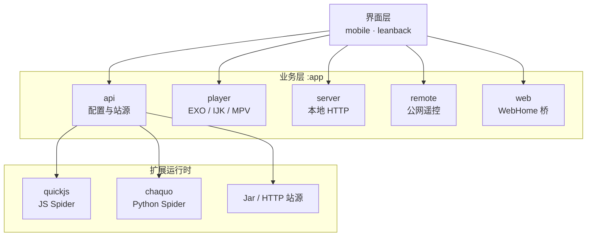

<div align="center">


# WebHomeTV

**自带配置源的 Android 影音播放器壳子**

手机 · 电视 · 同一套代码 · 不内置任何内容

[](https://github.com/motao123/webtv/releases)
[](https://github.com/motao123/webtv/actions/workflows/ci.yml)
[](LICENSE.md)
[](https://github.com/motao123/webtv/stargazers)
[](https://github.com/motao123/webtv/commits/main)
[](#下载与安装)
[](#下载与安装)
[](#技术栈)


</div>

---

## 目录

| 板块 | 内容 |
| :-- | :-- |
| [**项目简介**](#项目简介) | 定位、边界、适合谁 |
| [**界面预览**](#界面预览) | 真机截图 |
| [**核心能力**](#核心能力) | 播放 / 配置 / WebHome / 安全 / 发布 |
| [**下载与安装**](#下载与安装) | 10 个安装包与选型 |
| [**快速上手**](#快速上手) | 三步跑起来 |
| [**使用示例**](#使用示例) | 配置、WebHome SDK、局域网、遥控、更新 |
| [**架构概览**](#架构概览) | 分层与主链路 |
| [**工程结构**](#工程结构) | 目录与模块职责 |
| [**技术栈**](#技术栈) | 选型与版本 |
| [**构建与开发**](#构建与开发) | 环境、命令、变体矩阵、CI |
| [**常见问题**](#常见问题) | 高频疑问速查 |
| [**贡献指南**](#贡献指南) | 如何提交改动 |
| [**开源协议**](#开源协议) | GPL-3.0 与合规声明 |

---

## 项目简介

**WebHomeTV** 是基于 **FongMi / CatVod** 生态增强维护的 Android 影音播放器壳子，包名 `com.fongmi.android.tv`。同一套代码同时产出**手机端**与**电视端**，内容完全由用户自带。

它解决的问题很具体：**让「自带配置」这件事更容易**——导入更稳、管理更清楚、多设备之间能迁移。

<table>
<tr><th align="left">它做</th><th align="left">它不做</th></tr>
<tr valign="top"><td>

- 导入点播 / 直播 / 壁纸配置（URL、文件、assets、局域网同步）
- WebHome：给站点配独立网页首页，并开放原生能力给网页
- 配置、历史、收藏、登录态在手机与电视间一键同步
- 局域网管理页 + 可自托管的公网遥控

</td><td>

- 不内置任何影视内容
- 不分发、不托管、不推荐任何 JSON / 站源
- 不提供公共遥控服务器（服务端随源码给出，需自行部署）

</td></tr>
</table>

**适合谁**：已有自己的 TVBox / FongMi / CatVod 配置源；想在电视端用 WebHome 自定义首页；想把手机与电视的配置和进度同步起来；想把播放器壳子与内容源彻底分离。

---

## 界面预览

<div align="center">


<sub>原生首页 · 分类切换 · 评分与海报墙</sub>

</div>

---

## 核心能力

### 播放与内核

| 能力 | 说明 |
| :-- | :-- |
| 多内核 | EXO / IJK / MPV 三选一，默认 EXO；精简版仅 EXO + IJK |
| 播放连续性 | 换源、换集、解析播放后保持进度与倍速一致 |
| 控制增强 | 播放中重播、内核热切换、0.1x–5x 倍速微调、章节选择、错误阶段提示 |
| 字幕与解码 | 字幕样式高级设置、双字幕、音频直通、Dolby Vision 输出策略 |
| 弹幕 | 总开关与播放页状态强一致，关闭后不会被换集 / 云搜隐式打开 |
| 直播 | 失败自动换源、自定义 EPG、时移、分组 |
| 预加载 | 按内核配置线程 / 缓存 / 时长，自动预加载下一集 |
| 协议 | 已接入 Force、JianPian、Thunder、TVBus 等 FongMi 协议扩展 |
| 投屏 | 手机端可投屏；电视端可作 DLNA Renderer 接收投屏 |

### 配置与同步

| 能力 | 说明 |
| :-- | :-- |
| 导入增强 | 导入前预检，**失败不覆盖**当前配置；支持 URL / 文件 / assets |
| 配置管理 | 查看当前与历史配置、来源类型、最后使用时间；删除前提示关联影响 |
| 一键同步 | 同步配置与站源、脚本 / Jar、WebHome、搜索记录、继续观看、收藏、设置、登录态 |
| 登录态学习 | 学习 Cookie / 登录态文件路径并跨设备迁移；可预览候选文件内容 |
| 进度与收藏 | 强化恢复路径，配置缺失时提供回退 |
| 搜索相关性 | 结果按关键词匹配度过滤与排序 |

### WebHome 与扩展

| 能力 | 说明 |
| :-- | :-- |
| 网页首页 | 每个 CSP 站点可配独立网页首页，支持透明背景 |
| Native SDK | 网页通过 `window.fm` 调用受信任范围内的原生播放 / 搜索 / 请求 / 缓存 |
| 内嵌播放 | 网页可把剧集数据直接交给播放器（`player.playVodInline`），无需站点接口即可开播 |
| CSP 预热 | 配置加载后预初始化 Jar CSP，并隔离插件自带 protobuf，减少首开与版本冲突 |
| 开发套件 | [`webhome-devkit/`](webhome-devkit/README.md) 提供示例、模板与 AI skills |

### 安全与管理

| 能力 | 说明 |
| :-- | :-- |
| 本地接口加固 | 写操作端点强制 token（含回环请求）、DNS rebinding 防护 |
| SSRF 防护 | 网关禁用自动重定向并逐跳校验；拒绝私有 / 回环 / 链路本地地址 |
| 其它加固 | 路径遍历、XXE、DoS 防护；CORS 白名单收紧到精确端口 |
| 家庭过滤 | 按关键词屏蔽客厅不宜内容，并隐藏指定来源项 |
| 网盘检测 | 校验网盘分享链接有效性，WebHome 与本地 HTTP 均可调用 |
| 多语言 | 英文 / 简体中文 / 繁体中文；手机端可调界面缩放；内置 27 款壁纸 |

### 发布与更新

| 能力 | 说明 |
| :-- | :-- |
| 多源更新 | GitHub Release / 自建镜像 / CNB 多源切换 |
| 断点续传 | 中断保留进度，同源最多重试 3 次，耗尽后换源并按 HTTP Range 续传 |
| 多重校验 | 体积 → SHA-256 → 包名 → versionCode/versionName → 签名指纹 |
| 安装兜底 | 自动安装失败时导出 APK 到 Downloads 手动安装 |
| 崩溃可定位 | 发布构建上传 R8 mapping，线上堆栈可精确反混淆 |

---

## 下载与安装

最新版本 **v5.17.0** · 一次发版产出 **10 个安装包**（手机 / 电视 × 完整 / 精简 × 三种架构）。

<table>
<tr><th align="left">下载渠道</th><th align="left">地址</th></tr>
<tr><td>GitHub Releases（主）</td><td><a href="https://github.com/motao123/webtv/releases">github.com/motao123/webtv/releases</a></td></tr>
<tr><td>项目主页</td><td><a href="https://motao123.github.io/webtv/">motao123.github.io/webtv</a></td></tr>
<tr><td>CNB 源码镜像（代码 · 评审）</td><td><a href="https://cnb.cool/code_free/webtv-coding">cnb.cool/code_free/webtv-coding</a></td></tr>
<tr><td>CNB APK 镜像（产物 · 宝塔拉取源）</td><td><a href="https://cnb.cool/code_free/webtv">cnb.cool/code_free/webtv</a></td></tr>
</table>

| 设备 | 完整版 | 精简版 |
| :-- | :-- | :-- |
| Android TV · 不确定架构 | `leanback-universal.apk` | `leanback-lite-universal.apk` |
| Android TV · 新电视盒子 | `leanback-arm64_v8a.apk` | `leanback-lite-arm64_v8a.apk` |
| Android TV · 老盒子 | `leanback-armeabi_v7a.apk` | — |
| Android 手机 · 不确定架构 | `mobile-universal.apk` | `mobile-lite-universal.apk` |
| Android 手机 · 新设备 | `mobile-arm64_v8a.apk` | `mobile-lite-arm64_v8a.apk` |
| Android 手机 · 老设备 | `mobile-armeabi_v7a.apk` | — |

> 上表是产物标识；实际发布时文件名会附带版本号（如 `mobile-arm64_v8a-5.16.0.apk`），下载时以实际文件名为准。

**选型建议**

- **不确定 CPU 架构** → 选对应设备的 `universal`。
- **存储紧张 / 只要基础播放** → 选 `lite`：去掉 MPV 内核（约 37MB）与 Python 运行时（约 21MB），体积约为完整版一半。
- **需要 Python 类型直播源**（央视频、央视官网、广东广电官方解析等）→ **必须用完整版**。

> 精简版与完整版包名相同，可互相覆盖安装；应用内更新按 `*-lite-*.json` 独立清单分发，不会跨形态"升级"。

---

## 快速上手

```text
① 下载对应 APK 安装          Android 7.0（API 24）及以上
② 设置 → 填入你的配置 URL     或选择本地配置文件 / 局域网同步导入
③ 开始浏览、搜索、收藏、播放
```

常用入口：

```text
设置 → 增强功能      网盘检测 · 管理页面 · WebHome 扩展 · 登录态学习 · 一键同步 · 调试日志
设置 → 版本检查      应用内更新
```

> **首次启动会弹出「远程依赖确认」**——这是 App 请求你确认加载配置中的远程 jar，属于安全机制。**只信任你自己配置来源的内容**。

---

## 使用示例

### 例 1 · 给站点指定 WebHome 首页

在点播 JSON 的站点条目里加 `homePage` 字段（别名 `home_page` / `webHome` / `web_home`）。注意它**不是** `ext`——`ext` 是爬虫扩展参数。

```json
{
  "sites": [
    {
      "key": "mysite",
      "name": "我的站点",
      "type": 3,
      "api": "csp_MySpider",
      "homePage": "https://example.com/home/index.html"
    }
  ]
}
```

其中 `type: 3` 表示该站点是 Spider 类型（`api` 以 `csp_` 开头）。

### 例 2 · 网页调用原生能力

<details>
<summary><b>展开 <code>window.fm</code> 能力表</b></summary>

| 方法 | 说明 |
| :-- | :-- |
| `fm.req(url, options)` | 原生请求，绕过普通浏览器 CORS 限制 |
| `fm.res(url, options)` | 生成本地资源网关地址 |
| `fm.play(url, title, options)` | 播放直链或 `push://` 地址 |
| `fm.vod(siteKey, vodId, title, pic)` | 打开原生详情 / 播放链路 |
| `fm.search(keyword, { direct })` | 调用原生搜索 |
| `fm.openLive()` / `fm.openKeep()` / `fm.openSetting()` | 打开原生页面 |
| `fm.history()` | 读取最近观看记录 |
| `fm.config()` | 获取当前配置与家庭过滤状态 |
| `fm.site()` | 获取当前站点信息 |
| `fm.cache` | 本地缓存能力 |
| `fm.back()` / `fm.reload()` | 处理返回与刷新 |

</details>

把网页上的一集交给 App 播放：

```js
async function playEpisode(vodId, title, pic, episodeUrl) {
  // 推荐：走原生详情 / 播放链路，可使用换源、历史、弹幕等能力
  await window.fm.vod('mysite', vodId, title, pic);

  // 也可直接播放直链
  // await window.fm.play(episodeUrl, title);
}
```

### 例 3 · 局域网管理页

从 App 的「**设置 → 增强功能 → 管理页面**」取得地址，在同一局域网的手机或电脑浏览器中打开。

- 文件管理、一键同步、调试日志、配置管理
- 查看播放状态与进度，发送播放 / 暂停 / 停止 / 上下集 / 循环 / 重播
- 远端设备需**单独配对**——发现设备 ≠ 获得控制权限

> ⚠️ 端口由 App 动态分配，**请使用 App 显示的完整地址**，不要固定假定为 9978。管理地址与配对凭据属敏感信息，请勿公开分享。

### 例 4 · 公网遥控（自托管）

与局域网管理是**两套独立连接**：电视**主动连接**你部署的 HTTPS 中转服务，**不需要、也不应把本地管理端口暴露到公网**。

```text
部署中转服务（见 serverless/webtv-remote-go）
  → 设备端填写服务地址并启用（默认关闭）
  → 被控设备生成限时配对码
  → 网页控制台输入配对码完成绑定
  → 执行搜索 / 推送播放地址 / 播放控制 / 读取状态
```

连接优先 WebSocket，并提供 HTTP 轮询回退；配对码仅可用一次，不再使用时请**撤销设备授权**。

### 例 5 · 应用内更新

```text
设置 → 版本检查
```

下载中断会保留进度并断点续传；完成后交给系统安装器，失败则导出到 Downloads 手动安装。

---

## 架构概览



**四条主链路**

1. **播放**：配置解析站点 → 选择内核 → `player` 封装 EXO / IJK / MPV → 播放页与 OSD
2. **扩展**：`api` 按站点 `type` 分派 Spider（Jar / JS / Python）或 HTTP 站源，失败可重试
3. **同步**：本地 HTTP `server` 承载管理页，与另一台设备配对后交换配置与壳子状态
4. **遥控**：`remote` 主动连自托管中转，经配对授权后执行受限命令

---

## 工程结构

```text
TV/
├── app/                        Android 主应用
│   ├── src/main/               手机 / 电视共用业务逻辑（Java）
│   │   └── java/com/fongmi/android/tv/
│   │       ├── api/            配置与站源加载
│   │       ├── bean/           数据模型
│   │       ├── db/             Room 数据库
│   │       ├── playback/       播放状态与续播
│   │       ├── player/         EXO / IJK / MPV 封装（最大子包）
│   │       ├── remote/         公网遥控
│   │       ├── server/         本地 HTTP 服务与管理页接口
│   │       ├── setting/        设置项
│   │       ├── ui/             页面与控件
│   │       ├── update/         应用内更新与校验
│   │       ├── utils/          工具类（含依赖信任校验）
│   │       └── web/            WebHome 与原生桥接
│   ├── src/mobile/             手机端 UI 与清单
│   ├── src/leanback/           电视端 UI 与清单
│   ├── src/full/ src/lite/     完整版 / 精简版编译差异
│   ├── schemas/                Room schema
│   └── proguard-rules*.pro     混淆规则（含 ViewBinding 保护）
├── catvod/                     CatVod 抽象层与 Spider 接口
├── chaquo/                     Python 运行时（仅 full 参与打包）
├── quickjs/                    JavaScript 运行时
├── docs/                       Pages 站点（下载页与封面图）
├── webhome-devkit/             WebHome 开发套件（skills / templates / examples）
├── serverless/webtv-remote-go/ 自托管公网遥控中转（Go）
├── scripts/                    构建与发布脚本
├── third_party/                本地 Maven、依赖锁定与补丁源码
├── .github/workflows/          GitHub 侧 CI · 发版 · EPG 同步 · Pages 部署 · 源码镜像
└── .cnb.yml                    CNB 侧 PR 评审（npc:go）与编译门禁
```

> **双仓库架构**：GitHub `motao123/webtv` 是**唯一可写源**；CNB `code_free/webtv-coding` 是它同步来的**只读镜像**
> （`cnb-source-mirror.yml`，全部分支 + 全部标签）。**改代码请在 GitHub 开分支 / 发 PR** —— 在 CNB 侧直接提交的改动
> 不会被同步回来，且下一次镜像同步会把它拦下并告警（镜像只快进、不强制覆盖，不会静默生效）。
> **APK 产物镜像**在 `code_free/webtv`，由发版流程重建，仓库里不需要任何源码。路径别改混：
> **代码路径指向源码仓，产物路径（App 内置更新源、宝塔 `pull_apk.sh`）始终指向 `code_free/webtv`。**

---

## 技术栈

| 分类 | 选型 |
| :-- | :-- |
| 语言 | **Java 21**（core library desugaring） |
| 构建 | Gradle Wrapper + AGP + Version Catalog（`gradle/libs.versions.toml`） |
| 平台 | `minSdk 24`（Android 7.0）· `targetSdk 37` · `compileSdk 37` |
| 播放内核 | Media3 / ExoPlayer（内置定制版 `1.11.0-alpha01-fongmi`）、IJK、MPV |
| 扩展运行时 | QuickJS（JS Spider）· Chaquo（Python Spider）· JAR · HTTP API |
| 数据与网络 | Room · OkHttp · NanoHTTPD · JGit · jUPnP（DLNA） |
| UI | ViewBinding · Material · Leanback（电视）· Lottie · Glide |
| 其它 | EventBus · NewPipeExtractor · TensorFlow Lite · zxing · biometric |
| 附属服务 | Go 编写的自托管公网遥控中转 |

**Gradle 模块**

| 模块 | 职责 |
| :-- | :-- |
| `:app` | Android 主应用（`main` 共用 + `mobile` / `leanback` 两套 UI） |
| `:catvod` | CatVod 抽象层：Spider 接口、OkHttp、代理工具 |
| `:quickjs` | JavaScript Spider 运行时 |
| `:chaquo` | Python Spider 运行时（仅 `full`） |

---

## 构建与开发

**环境要求**

| 依赖 | 版本 |
| :-- | :-- |
| JDK | **21**（`gradle/gradle-daemon-jvm.properties` 已声明工具链 21） |
| Android SDK | `platforms;android-37.0`、`build-tools;37.0.0` |
| Python（宿主机） | **3.10**，仅编译 Chaquopy Python 源码时需要 |
| Gradle | 使用仓库内置 `gradlew`，无需单独安装 |

**常用命令**

```bash
# 编译 + 单测（与 CI 一致）
./gradlew :app:compileMobileFullArm64_v8aDebugJavaWithJavac \
          :app:compileLeanbackFullArm64_v8aDebugJavaWithJavac \
          :catvod:compileDebugJavaWithJavac
./gradlew :app:testMobileFullArm64_v8aDebugUnitTest

# 打包（末尾 Release 可换 Debug 做本地调试）
./gradlew :app:assembleMobileFullUniversalRelease
./gradlew :app:assembleMobileFullArm64_v8aRelease
./gradlew :app:assembleMobileFullArmeabi_v7aRelease
./gradlew :app:assembleLeanbackFullUniversalRelease
./gradlew :app:assembleLeanbackFullArm64_v8aRelease
./gradlew :app:assembleLeanbackFullArmeabi_v7aRelease
./gradlew :app:assembleMobileLiteUniversalRelease
./gradlew :app:assembleMobileLiteArm64_v8aRelease
./gradlew :app:assembleLeanbackLiteUniversalRelease
./gradlew :app:assembleLeanbackLiteArm64_v8aRelease
```

产物路径：`app/build/outputs/apk/<变体>/release/<包名>.apk`

**变体矩阵**：`mode`(mobile/leanback) × `edition`(full/lite) × `abi`(universal/arm64_v8a/armeabi_v7a)，任务名规则 `assemble` + Mode + Edition + Abi + `Release`。`lite` 不产出 `armeabi_v7a`，因此 **6 + 4 = 10 个包**。

**签名**：Release 构建必须提供签名，否则在配置阶段直接中止。

```properties
# local.properties（不入库）
sdk.dir=/path/to/Android/Sdk
storeFile=/absolute/path/to/release.keystore
keyAlias=your_key_alias
storePassword=your_store_password
```

**CI / 发版**

| 工作流 | 触发 | 作用 |
| :-- | :-- | :-- |
| `ci.yml` | push / PR → main | 编译手机与电视端 + 单测（仅 Debug，不依赖签名密钥） |
| `android-release.yml` | `v*` 标签 / 手动 | 构建 10 个 APK 并创建 Release，附下载页与 R8 mapping |
| `pages.yml` | push → main | 部署 GitHub Pages 下载站 |
| `epg-sync.yml` | 每 4 小时 | 同步 EPG 数据 |
| `remote-relay.yml` | push / PR | 中转服务测试 |
| `cnb-source-mirror.yml` | push → main / `v*` 标签 / 每日兜底 | 全分支全标签镜像到 CNB `webtv-coding`（只快进，遇到分叉显式失败） |
| `.cnb.yml`（CNB 侧） | CNB 侧 PR / 评论 `@NPC` | PR 自动代码评审（`npc:go`）与轻量编译门禁 |

---

## 常见问题

<details>
<summary><b>展开 9 条高频疑问</b></summary>

**装完是空的，没有影视内容？**
设计如此。本仓库是播放器壳子，不内置内容、不分发 JSON。请在设置中导入你自己的合法配置源。

**全新安装后首页一片空白，且不再弹确认框？**
v5.15.0 修复的已知问题——冷启动时若尚未拿到可用页面上下文，远程依赖的信任确认会被静默跳过，且失败结果被错误缓存，导致该站点在本进程内永久加载不出来。**请升级到 v5.15.0 或更高版本**。

**精简版（lite）和完整版有什么区别？**
精简版去掉 MPV 内核与 Python 运行时，体积约为完整版一半，保留 EXO/IJK 双内核、QuickJS/JS 源与全部协议能力。**代价是 Python 类型直播源不可用**。

**应用内更新一直失败？**
更新器已支持断点续传与多源切换。若仍失败，通常是网络对更新源不可达——可直接下载 APK 手动覆盖安装（同签名可覆盖，不丢数据）。

**Release 构建报 `Release signing is required for release builds`？**
缺少签名配置。按上文「签名」在 `local.properties` 填好 `storeFile` / `keyAlias` / `storePassword`。

**本地 Gradle 提示 JDK 版本不对？**
本项目要求 **JDK 21**。若系统是 JDK 8/11/17，请让 `JAVA_HOME` 指向 JDK 21 后再执行 `gradlew`。

**本地单元测试跑不过，但 CI 是绿的？**
本地环境容易因测试类未被加入 worker classpath 而报 `ClassNotFoundException`。**以 CI 结果为准**。

**局域网管理页打不开 / 端口不是 9978？**
端口由 App 动态分配，请以「设置 → 增强功能 → 管理页面」显示的完整地址为准，并确保设备在同一局域网。

**怎么自己开发 WebHome 首页或注入脚本？**
先用 [`webhome-devkit/`](webhome-devkit/README.md) 的模板与示例起步（扩展开发指南不随仓库公开，维护者见内部文档）。

</details>

---

## 贡献指南

**流程**

```bash
git clone https://github.com/motao123/webtv.git && cd webtv
# 国内网络可改用 CNB 源码镜像（内容一致，由 cnb-source-mirror.yml 自动同步）
# git clone https://cnb.cool/code_free/webtv-coding.git && cd webtv-coding

git checkout -b fix/your-topic

# 改完先本地编译，再推分支让 CI 验证
git commit -m "fix: 一句话说清动机"
git push origin fix/your-topic
# 然后在 GitHub 上向 main 提 Pull Request
```

**约定**

- **提交信息**：沿用 Conventional Commits 前缀（`fix:` / `feat:` / `docs:` / `chore:` / `build:`），标题写清"为什么"。
- **CI 是准入门槛**：`ci.yml` 的编译与单测必须通过。本地单测可能因测试类未进 worker classpath 而误报 `ClassNotFoundException`，**以 CI 结果为准**。
- **不要提交**：`local.properties`、keystore、`debug/` 下的调试产物（均已在 `.gitignore` 中）。
- **改动前先看上游**：本项目是 FongMi / CatVod 的二次开发，涉及与上游行为不一致的改动，请在 PR 中说明理由。
- **发版由维护者执行**：合并到 `main` 后由维护者打 `v*` 标签触发发行构建。

**提交前自检**

```bash
./gradlew :app:compileLeanbackFullArm64_v8aDebugJavaWithJavac \
          :app:compileMobileFullArm64_v8aDebugJavaWithJavac
```

---

## 开源协议

本项目采用 **[GNU General Public License v3.0](LICENSE.md)**（GPL-3.0）。你可以自由使用、修改与分发，但**衍生作品必须以相同协议开源**并保留版权声明——这正是本项目作为 FongMi / CatVod 二次开发所遵循的方式。

提交 Pull Request 即表示你同意你的贡献按同一协议授权。

**合规声明**

> 本仓库只提供技术实现和播放器壳子能力：**不内置影视内容、不维护站源、不分发 JSON、不提供内容接口**。
> 所有内容来源均由用户自行配置，请确保合法合规，并遵守所在地区的法律法规。

已知可接受风险（记录在案）：

- 迅雷网盘签名密钥内嵌于客户端，属客户端签名固有限制。
- 直播 / 媒体源普遍使用明文 HTTP，无法全局禁用；配置源与更新服务器已强制 HTTPS。
- Android `addJavascriptInterface` 无法按 iframe 区分信任来源，属平台限制。

---

<div align="center">

**文档** ·
[开发套件](webhome-devkit/README.md) ·
[更新日志](CHANGELOG.md)

<sub>基于 <a href="https://github.com/FongMi/TV">FongMi / CatVod</a> 生态二次开发</sub>

</div>
